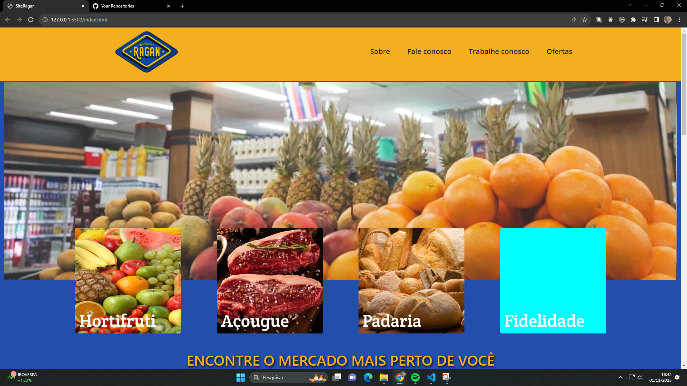

<h1 text-align="center">Website Supermercado Ragan</h1>

## :memo: Descrição
Projeto de website desenvolvido para a rede de supermercados Ragan.

 

 
 ### :computer: Visualização Desktop 
 
 

 ###  :iphone: Visualização mobile

 
 
 

## :books: Funcionalidades
* <b>Responsividade</b>: website totalmente responsivo.
* <b>Carrosel</b>: Slides das filiais e formas de pagamento.

##  :wrench: Tecnologias utilizadas

* 
* 
* 
* 

## :handshake: Colaboradores
* <table>
  <tr>
    <td text-align="center">
      <a href="https://github.com/viniciusleandro">
        
          <b>@ViníciusBrodt</b>
        
      </a>
    </td>
  </tr>
</table>

## :dart: Status do projeto
:construction: Projeto em construção :construction:
